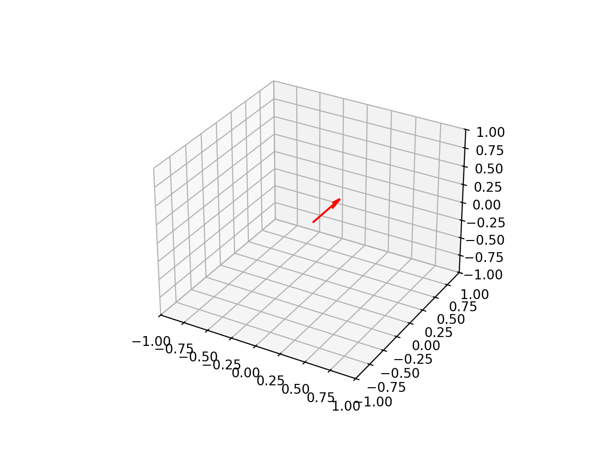
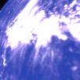
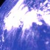
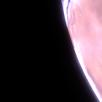
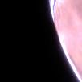

# Satellite Image Generation

This project consists of two Python scripts, `info_extractor.py` and `positions_generator.py`, designed to process and generate synthetic satellite images. The `info_extractor.py` script processes satellite images to extract key information such as satellite positions, velocities, and sun positions, and saves the extracted data into a JSON file. The `positions_generator.py` script generates N satellite positions for use in a Unity simulation. The generated images are stored in the *SyntheticImages* folder.

### Usage

1. Ensure the TLE data file `LTE.txt` is in the same directory as the scripts.
2. To generate satellite positions, run the script with parameters:
   ```sh
   python positions_generator.py --year 2024 --step 3600 --frames 3 --num_bursts 2 --image_width 102 --image_height 102 --mode generate
   ```
   - `--year`: Starting year (default: 2024)
   - `--step`: Time step in seconds (default: 3600)
   - `--frames`: Frames per burst (default: 3)
   - `--num_bursts`: Bursts per position (default: 2)
   - `--image_width`: Image width in pixels (default: 102)
   - `--image_height`: Image height in pixels (default: 102)
   - `--mode`: Operation mode: 'debug' or 'generate' (default: 'debug')
   - `--output`: Output JSON path (default: `Simulation/Assets/Resources/generated_positions.json`)
3. **Important**: Set `--mode generate` to automatically start image generation in Unity
4. The script will create a `generated_positions.json` file
5. Open Unity and load the project
6. Press "Play" to generate images (only in 'generate' mode)

### Modes

- **`generate`**: the capture loop runs unattended and quits when done. Manual camera controls are **disabled** in this mode — mouse-look would perturb the scripted rotations, and a stray Enter press would inject an extra frame into a burst and misalign every later burst in the merge step.
- **`debug`**: no images are written automatically. Space steps to the next position, right-mouse drag looks around, and Enter captures a single screenshot manually.

## File Naming Convention

The image file names follow this pattern:

```csharp
string filePath = $"{screenshotFolder}/{sat.name}_{sat.index}_{sat.numBurst}_{sat.burstIndex}_{sat.time}_{satPos}_{satRot}.jpg";
```

This naming convention includes the following components:

1. **`{sat.name}`**: Name of the satellite (e.g., "cubesat")
2. **`{sat.index}`**: Position index in the capture sequence (0-9 for 10 positions)
3. **`{sat.numBurst}`**: Burst index within a position (0-4 for 5 bursts/position)
4. **`{sat.burstIndex}`**: Frame index within a burst (0-2 for 3 frames/burst)
5. **`{sat.time}`**: Seconds since year start (replaces dates for yearly consistency)
6. **`{satPos}`**: Satellite position in spatial coordinates (X, Y, Z)
7. **`{satRot}`**: Satellite rotation as quaternion values


This dynamically generated name helps ensure that each screenshot is unique based on the satellite's properties and the current date and time.

## Merging and Filtering (`scripts/filter.py`)

Raw capture folders (named `{frames}_{degrees}_{timestamp}`) are filtered, downsampled, and merged into a single training dataset:

```sh
python scripts/filter.py -p SyntheticImages -ih 102 -iw 102 -f 3 -d 1
```

- A whole burst is discarded if **any** of its frames is empty: more than `--threshold` (default `0.95`) dark pixels, or fewer than `--bright_ratio` (default `0.2`) pixels brighter than 200.
- Kept images are downsampled to `--image_width` × `--image_height` (LANCZOS) and re-saved as JPEG at quality 95 to avoid compounding the capture-time compression.
- Output lands in `SyntheticImages/{width}_{height}_{frames}_{degrees}_merged`.
- Files are renamed to a 5-field format:

  ```
  {sat_name}_{count}_{elapsed_time}_{position}_{rotation}.jpg
  ```

  where `count` is a **unique counter per burst** (it does *not* identify a trajectory point). All bursts captured at the same trajectory point share the exact same `position` string — this is the field the training repo's loader groups on to keep every view of a scene on one side of its train/val/test split.

## Tumbling

<div style="display: grid; grid-template-columns: repeat(3, auto); gap: 10px; justify-items: center;">
    
</div>

## Examples
Below are examples of synthetic satellite images generated by the project:

<div style="display: grid; grid-template-columns: repeat(3, auto); gap: 10px; justify-items: center;">
    
    
    
    
    
    
</div>